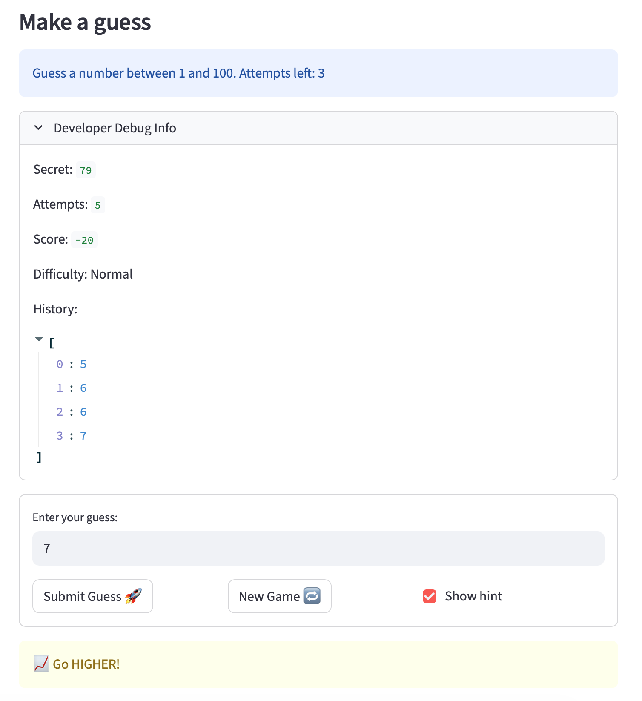

# 🎮 Game Glitch Investigator: The Impossible Guesser

## 🚨 The Situation

You asked an AI to build a simple "Number Guessing Game" using Streamlit.
It wrote the code, ran away, and now the game is unplayable. 

- You can't win.
- The hints lie to you.
- The secret number seems to have commitment issues.

## 🛠️ Setup

1. Install dependencies: `pip install -r requirements.txt`
2. Run the broken app: `python -m streamlit run app.py`

## 🕵️‍♂️ Your Mission

1. **Play the game.** Open the "Developer Debug Info" tab in the app to see the secret number. Try to win.
2. **Find the State Bug.** Why does the secret number change every time you click "Submit"? Ask ChatGPT: *"How do I keep a variable from resetting in Streamlit when I click a button?"*
3. **Fix the Logic.** The hints ("Higher/Lower") are wrong. Fix them.
4. **Refactor & Test.** - Move the logic into `logic_utils.py`.
   - Run `pytest` in your terminal.
   - Keep fixing until all tests pass!

## 📝 Document Your Experience

- [ ] Describe the game's purpose.
The game is guess the number. The purpose of the game is to nudge users to the correct secret number through hints like the current guess is too high or too low. Users aim to guess the correct number within the allowed number of guesses for a difficulty level.
- [ ] Detail which bugs you found.
I noticed several bugs, including:
- The hints are backwards.
- Pressing the Enter key to submit the guess doesn't work.
- Guesses are not registered immediately. There's a delay of about 1 turn.
- The difficulty levels don't make sense.
- Clicking the "New Game" button does nothing.
- [ ] Explain what fixes you applied.
I fixed the hints, the "New Game" button, and pressing Enter to submit.

## 📸 Demo

- [ ] 

## 🚀 Stretch Features

- [ ] [If you choose to complete Challenge 4, insert a screenshot of your Enhanced Game UI here]
